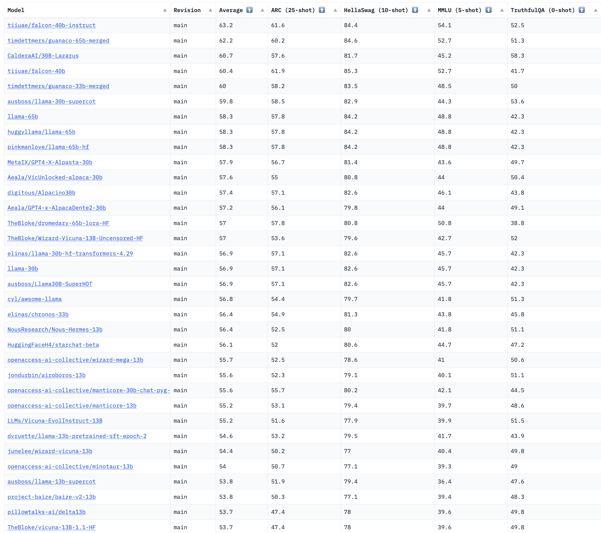
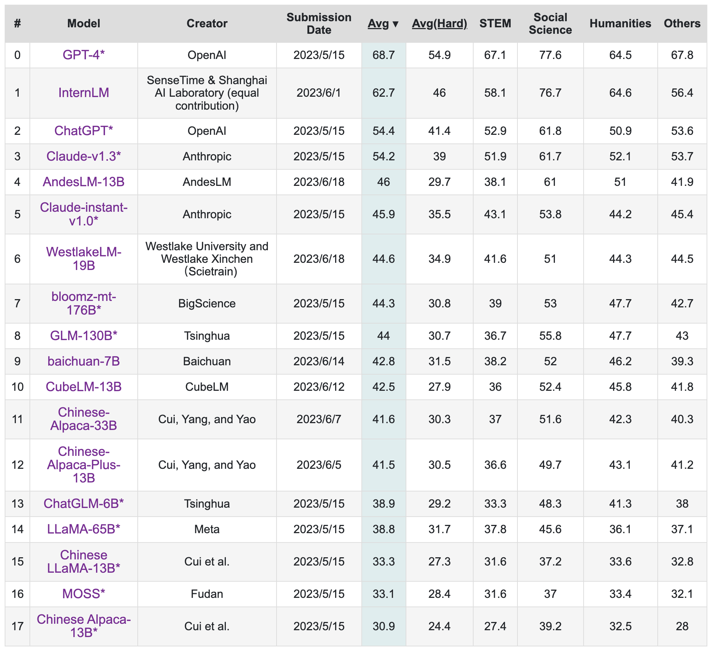
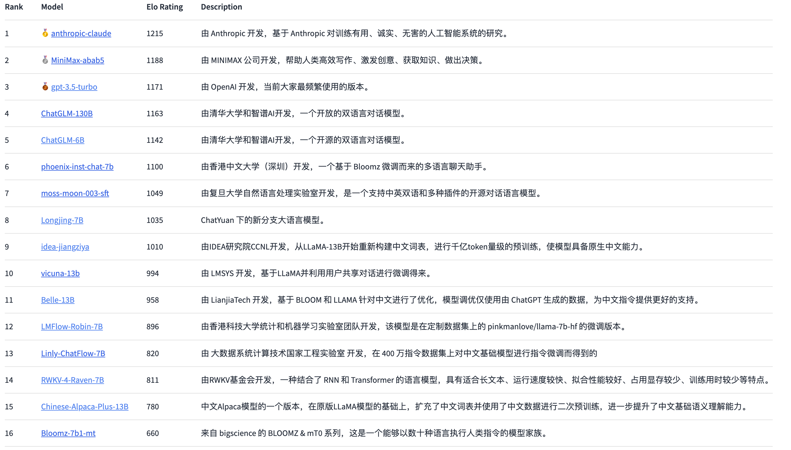
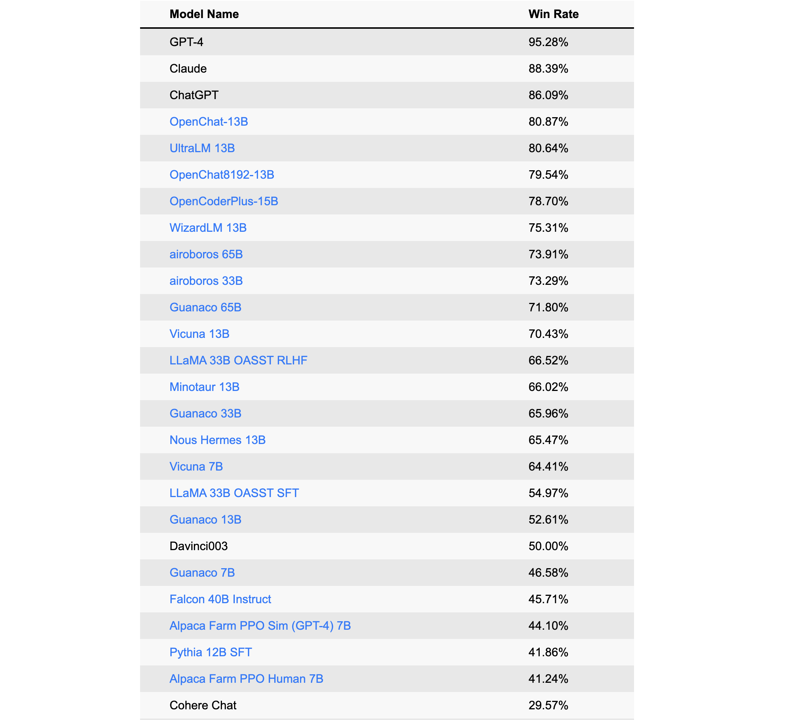

# 寻找那些ChatGPT/GPT4开源“平替”们
ChatGPT/GPT4开源“平替”汇总，持续更新

ChatGPT爆火出圈，国内很多高校、研究机构和企业都发出类似ChatGPT的发布计划。ChatGPT没有开源，复现难度极大，即使到现在GPT3的完全能力也没有任何一个单位或者企业进行了复现。刚刚，OpenAI又官宣发布了图文多模态的GPT4模型，能力相对ChatGPT又是大幅提升，似乎闻到了以通用人工智能主导的第四次工业革命的味道。

无论是国外还是国内，目前距离OpenAI的差距越来越大，大家都在紧锣密鼓的追赶，以致于在这场技术革新中处于一定的优势地位，目前很多大型企业的研发基本上都是走闭源路线，ChatGPT和GPT4官方公布的细节很少，也不像之前发个几十页的论文介绍，OpenAI的商业化时代已经到来。当然，也有一些组织或者个人在开源平替上进行了探索，本文章汇总如下，本人也会持续跟踪，有更新的开源平替及时更新此处

## 一、自主模型篇
        该类方法主要采用非LLAMA等微调方式，自主设计或者优化GPT、T5模型，并实现从预训练、监督微调、强化学习等全周期过程。
### ChatYuan

        ChatYuan（元语AI）是由元语智能开发团队开发和发布的，自称第一个国内最早的一个功能型对话大模型，可以写文章、写作业、写诗歌、做中英文间的翻译；一些法律等特定领域问题也可以提供相关信息。该模型目前只支持中文，github链接是：

        https://github.com/clue-ai/ChatYuan

        从披露的技术细节看，底层采用7亿参数规模的T5模型，并基于PromptClue进行了监督微调形成了ChatYuan。该模型基本上是ChatGPT技术路线的三步的第一步，没有实现奖励模型训练和PPO强化学习训练。

### Colossal AI

        最近，ColossalAI开源了他们的ChatGPT实现。分享了他们的三步策略，完整实现了ChatGPT核心的技术路线：其Github如下：

        https://github.com/hpcaitech/ColossalAI

        本人基于该项目，更加明确了三步策略，并进行了分享：

        第一阶段（stage1_sft.py）：SFT监督微调阶段，该开源项目没有实现，这个比较简单，因为ColossalAI无缝支持Huggingface，本人直接用Huggingface的Trainer函数几行代码轻松实现，在这里我用了一个gpt2模型，从其实现上看，其支持GPT2、OPT和BLOOM模型；

        第二阶段（stage2_rm.py）：奖励模型（RM）训练阶段，即项目Examples里train_reward_model.py部分；

        第三阶段（stage3_ppo.py）：强化学习（RLHF）阶段，即项目train_prompts.py

        三个文件的执行需要放在ColossalAI项目中，其中代码中的cores即原始工程中的chatgpt，cores.nn在原始工程中变成了chatgpt.models

### ChatGLM

        ChatGLM是清华技术成果转化的公司智谱AI开源的GLM系列的对话模型，支持中英两个语种，目前开源了其62亿参数量的模型。其继承了GLM之前的优势，在模型架构上进行了优化，从而使得部署和应用门槛变低，实现大模型在消费级显卡上的推理应用。详细技术可以参考其github：

        https://github.com/THUDM/ChatGLM-6B

        从技术路线上看，其实现了ChatGPT强化学习人类对齐策略，使得生成效果更佳贴近人类价值，其目前能力域主要包括自我认知、提纲写作、文案写作、邮件写作助手、信息抽取、角色扮演、评论比较、旅游建议等，目前其已经开发了正在内测的1300亿的超大模型，算是目前开源平替里面参数规模较大的对话大模型。

        VisualGLM-6B（更新于2023年5月19日）

        该团队近期开源了ChatGLM-6B的多模态版，支持图像、中文和英文的多模态对话。语言模型部分采用ChatGLM-6B，图像部分通过训练BLIP2-Qformer构建起视觉模型与语言模型的桥梁，整体模型共78亿参数。VisualGLM-6B依靠来自于CogView数据集的30M高质量中文图文对，与300M经过筛选的英文图文对进行预训练，中英文权重相同。该训练方式较好地将视觉信息对齐到ChatGLM的语义空间；之后的微调阶段，模型在长视觉问答数据上训练，以生成符合人类偏好的答案。

        VisualGLM-6B开源地址为：https://github.com/THUDM/VisualGLM-6B

### PaLM-rlhf-pytorch

        其号称首个开源ChatGPT平替项目，其基本思路是基于谷歌语言大模型PaLM架构，以及使用从人类反馈中强化学习的方法（RLHF）。PaLM是谷歌在今年4月发布的5400亿参数全能大模型，基于Pathways系统训练。其可以完成写代码、聊天、语言理解等任务，并且在大多数任务上具有强大的少样本学习性能。同时采用了ChatGPT一样的强化学习机制，能让AI的回答更加符合情景要求，降低模型毒性。
       
        Github地址为：https://github.com/lucidrains/PaLM-rlhf-pytorch

### GPTrillion 

        该项目号称开源的最大规模模型，高达1.5万亿，且是多模态的模型。其能力域包括自然语言理解、机器翻译、智能问答、情感分析和图文匹配等。其开源地址为：
        
        https://huggingface.co/banana-dev/GPTrillion

        （2023年5月24日，该项目是愚人节玩笑节目，项目已删除，特此说明）

        
### OpenFlamingo

        OpenFlamingo是一个对标GPT-4、支持大型多模态模型训练和评估的框架，由非盈利机构LAION重磅开源发布，其是对DeepMind的Flamingo模型的复现。目前开源的是其基于LLaMA的 OpenFlamingo-9B模型。Flamingo模型在包含交错文本和图像的大规模网络语料库上进行训练，具备上下文少样本学习能力。OpenFlamingo实现了原始Flamingo中提出的相同架构，在一个新的多模态C4数据集的5M样本和LAION-2B的10M样本上训练而来。该项目的开源地址是：
 
        https://github.com/mlfoundations/open_flamingo

### MOSS （更新于2023年4月21日）

        今年2月21日，复旦大学发布了MOSS，并开放公测，在公测崩溃后引起一些争议。现在该项目迎来重要更新和开源。开源的MOSS支持中英两个语种，且支持插件化，如解方程、搜索等。参数量大16B，在约七千亿中英文以及代码单词上预训练得到，后续经过对话指令微调、插件增强学习和人类偏好训练具备多轮对话能力及使用多种插件的能力。该项目的开源地址是：

        https://github.com/OpenLMLab/MOSS

### mPLUG-Owl （更新于2023年5月7日）
 
        与miniGPT-4、LLaVA类似，其是一个对标GPT-4的开源多模态大模型，其延续了mPLUG系列的模块化训练思想。其目前开源了7B参数量的模型，同时第一次针对视觉相关的指令理解提出一个全⾯的测试集 OwlEval，通过人工评测对比了已有模型，包括LLaVA、MiniGPT-4等工作，其展示出更优的多模态能力，尤其在多模态指令理解能力、多轮对话能力、知识推理能力等方⾯表现突出。目前遗憾的是跟其他图文大模型一样，仍然只支持英文，但中文版已在其待开源List中。

        该项目的开源地址是：https://github.com/X-PLUG/mPLUG-Owl

### PandaLM （更新于2023年5月9日）
 
        PandaLM是一个模型评估大模型，旨在对其他大模型生成内容的偏好进行自动评价，节省人工评估成本。PandaLM自带有Web界面进行分析，同时还支持Python代码调用，仅用三行代码即可对任意模型和数据生成的文本评估，使用很方便。

        该项目开源地址是：https://github.com/WeOpenML/PandaLM

### 悟道·天鹰 （更新于2023年6月12日）
 
        在近期召开的智源大会上，智源研究院开源了其悟道·天鹰大模型，具备中英双语知识。开源版本的基础模型参数量包括70亿和330亿，同时其开源了AquilaChat对话模型和quilaCode文本-代码生成模型，且都已经开放了商业许可。Aquila采用GPT-3、LLaMA等Decoder-only架构，同时针对中英双语更新了词表，并采用其加速训练方法。其性能上的保障不仅依赖于模型的优化改进，还得益于智源这几年在大模型高质量数据上的积累。

        该项目开源地址是：https://github.com/FlagAI-Open/FlagAI/tree/master/examples/Aquila

### CoDi（更新于2023年6月12日）
 
        近期，微软重磅发表多模态大模型论文和开源代码-CoDi，彻底打通文本-语音-图像-视频，支持任意输入，任意模态输出。为了达到任意模态的生成，研究者将训练分为两个阶段，第一个阶段作者利用桥接对齐策略，组合条件进行训练，给每个模态都打造一个潜在扩散模型；第二个阶段给每个潜在扩散模型和环境编码器上增加一个交叉注意力模块，就能将潜在扩散模型的潜变量投射到共享空间中，使得生成的模态也进一步多样化。

        该项目开源地址是：https://github.com/microsoft/i-Code/tree/main/i-Code-V3

### ImageBind（更新于2023年6月12日）
 
        Meta重磅推出和开源其多模态大模型ImageBind，可以实现跨6种模态，包括图像、视频、音频、深度、热量和空间运动，ImageBind通过使用图像的绑定特性，利用大型视觉语言模型和零样本能力扩展到新的模态来解决对齐问题。图像配对数据足以将这六种模态绑定在一起，允许不同的模式彼此打通模态割裂。

        该项目开源地址是：https://github.com/facebookresearch/ImageBind

### baichuan-7B（更新于2023年6月15日）
 
        2023年4月10日，王小川官宣创办AI大模型公司“百川智能”，旨在打造中国版的OpenAI。在成立了两个月后，百川智能重磅开源其自主研发的baichuan-7B模型，支持中英文。baichuan-7B不仅在C-Eval、AGIEval和Gaokao中文权威评测榜单上，以显著优势全面超过了ChatGLM-6B等其他大模型，并且在MMLU英文权威评测榜单上，大幅领先LLaMA-7B。该模型在高质量数据上达到万亿token规模，并基于高效的attention算子优化支持上万超长动态窗口的扩张能力，目前开源支持4K上下文能力。该开源模型可以商用，比LLaMA更加友好。

        该项目开源地址是：https://github.com/baichuan-inc/baichuan-7B

## 二、Alpaca模式篇

        LLaMA是由Meta发布的全新人工智能大型语言模型，在生成文本、对话、总结书面材料、证明数学定理或预测蛋白质结构等任务上方面表现良好。LLaMA模型支持20种语言，包括拉丁语和西里尔字母语言，目前看原始模型并不支持中文。可以说LLaMA的史诗级泄露大力推进了类ChatGPT的开源发展。

        （更新于2023年4月22日）但遗憾的是目前LLama的授权比较有限，只能用作科研，不允许做商用。为了解决商用完全开源问题，RedPajama项目应运而生，其旨在创建一个完全开源的LLaMA复制品，可用于商业应用，并为研究提供更透明的流程。完整的RedPajama包括了1.2万亿token的数据集，其下一步将着手开始进行大规模训练。这项工作还是非常值得期待，其开源地址是：

        https://github.com/togethercomputer/RedPajama-Data

        （更新于2023年5月7日）

        RedPajama更新了其训练模型文件，包括3B和7B两个参数量，其中3B可以在5年前发售的RTX2070游戏显卡上运行，弥补了LLaMa在3B上的空白。其模型地址为：

        https://huggingface.co/togethercomputer

        除了RedPajama，MosaicML推出MPT系列模型，其训练数据采用了RedPajama的数据，在各类性能评估中，7B模型与原版LLaMA旗鼓相当。其模型开源地址为：

        https://huggingface.co/mosaicml

        无论是RedPajama还是MPT，其同时也开源了对应的Chat版模型，这两个模型的开源为类ChatGPT商业化带来了巨大的推动。

        （更新于2023年6月1日）

        Falcon是对标LLaMA的有一个开放大模型底座，其拥有7B和40B两个参数量尺度，40B的性能号称超高65B的LLaMA。据了解，Falcon仍然采用GPT式的自回归解码器模型，但其在数据上下了大功夫，从公网上抓取内容构建好初始预训练数据集后，再使用CommonCrawl转储，进行大量过滤并进行大规模去重，最终得到一个由近5万亿个token组成的庞大预训练数据集。同时又加进了很多精选语料，包括研究论文和社交媒体对话等内容。但该项目的授权饱受争议，采用"半商业化"授权方式，在收益达到100万后开始有10%的商业费用。

        该项目开源地址是：https://huggingface.co/tiiuae

### stanford-alpaca

       斯坦福发布的alpaca（羊驼模型），是一个基于LLaMA-7B模型微调出一个新模型，其基本原理是让OpenAI的text-davinci-003模型以self-instruct方式生成52K指令样本，以此来微调LLaMA。该项目已将训练数据、生成训练数据的代码和超参数开源，模型文件尚未开源，以一天多达到5.6K星的关注度。该项工作由于成本低廉、数据易得，大受欢迎，也开启了低成本ChatGPT的效仿之路。其github地址为：

        https://github.com/tatsu-lab/stanford_alpaca

### ChatLLaMA

       是由Nebuly+AI推出的基于人类反馈强化学习的LLaMA+AI聊天机器人的开源实现，它的技术路线类似 ChatGPT，该项目上线刚刚 2 天，狂揽 5.2K 星。其github地址是：

        https://github.com/nebuly-ai/nebullvm/tree/main/apps/accelerate/chatllama

       ChatLLaMA 训练过程算法实现主打比 ChatGPT 训练更快、更便宜，据说能快近15倍，主要特色有：

        完整的开源实现，允许用户基于预训练的 LLaMA 模型构建 ChatGPT 风格的服务；

        LLaMA 架构更小，使得训练过程和推理速度更快，成本更低；

        内置了对 DeepSpeed ZERO 的支持，以加速微调过程；

        支持各种尺寸的 LLaMA 模型架构，用户可以根据自身偏好对模型进行微调。

### OpenChatKit

        OpenChatKit由前OpenAI研究员所在的Together团队，以及LAION、Ontocord.ai团队共同打造。OpenChatKit包含200亿个参数，用GPT-3的开源版本GPT-NoX-20B进行微调。同时，不同ChatGPT的强化学习，OpenChatKit采用一个60亿参数的审核模型，对不合适或者是有害的信息进行过滤，确保生成内容的安全和质量。其github地址为：

        https://github.com/togethercomputer/OpenChatKit

### BELLE

        基于 Stanford Alpaca ，实现基于Bloom、LLama的监督微调。Stanford Alpaca 的种子任务都是英语，收集的数据也都是英文，该开源项目是促进中文对话大模型开源社区的发展，针对中文做了优化，模型调优仅使用由ChatGPT生产的数据（不包含任何其他数据）。项目包含以下内容:

        175个中文种子任务
        
        生成数据的代码
        
       10M生成的数据，目前开源了1.5M、0.25M数学指令数据集和0.8M多轮任务对话数据集
        
        基于BLOOMZ-7B1-mt、LLama-7B优化后的模型
        
        github地址为：https://github.com/LianjiaTech/BELLE

### alpaca-lora

        alpaca-lora是斯坦福大学的另一个巨作，其使用LoRA（low-rank adaptation）技术复现了Alpaca的结果，用了一个更加低成本的方法，只在一块RTX 4090显卡上训练5个小时得到了一个Alpaca水平相当的模型。而且，该模型可以在树莓派上运行。在该项目中，其使用了Hugging Face的PEFT来实现廉价高效的微调。PEFT 是一个库（LoRA 是其支持的技术之一），可以让你使用各种基于 Transformer的语言模型并使用LoRA对其进行微调，从而使得在一般的硬件上廉价而有效地微调模型。该项目github地址是：
        
        https://github.com/tloen/alpaca-lora
        
        尽管 Alpaca和alpaca-lora取得了较大的提升，但其种子任务都是英语，缺乏对中文的支持。一方面除了以上提到Belle收集到了大量的中文语料，另一方面基于alpaca-lora等前人工作，来自华中师范大学等机构的三位个人开发者开源的中文语言模型骆驼 (Luotuo)，单卡就能完成训练部署。目前该项目释放了两个模型 luotuo-lora-7b-0.1、luotuo-lora-7b-0.3，还有一个模型在计划中。其github地址是：
        
        https://github.com/LC1332/Chinese-alpaca-lora
        
### Dolly

        Dolly在Alpaca的启发下，用Alpaca数据集，在GPT-J-6B上实现微调，由于Dolly本身是一个模型的“克隆”，所以团队最终决定将其命名为“多莉”。这种克隆式在Alpaca启发下越来越多，总结起来大致采用Alpaca开源的数据获取方式，在6B或者7B规模大小的旧模型上进行指令微调，获得类似ChatGPT的的效果。这种思想很经济，也能迅速模仿出ChatGPT的韵味来，广受欢迎，一经推出star爆棚。该项目github地址是：
        
        https://github.com/databrickslabs/dolly
       
### Vicuna和Chinese-Vicuna

        斯坦福学者继推出alpaca后，联手CMU、UC伯克利等，推出一个全新模型——130亿参数的Vicuna（俗称小羊驼、骆马）。仅需300美元就能实现ChatGPT 90%的性能。Vicuna是通过在ShareGPT收集的用户共享对话上对LLaMA进行微调训练而来，测试过程使用GPT-4作为评判标准，结果显示Vicuna-13B在超过90%的情况下实现了与ChatGPT和Bard相匹敌的能力。

        UC伯克利LMSys org近期又发布了70亿参数的Vicuna，不仅体积小、效率高、能力强，而且只需两行命令就能在M1/M2芯片的Mac上运行，还能开启GPU加速！
        
        github开源地址为：https://github.com/lm-sys/FastChat/

        另一个中文版的进行了开源Chinese-Vicuna ，github地址为：        

        https://github.com/Facico/Chinese-Vicuna 
        
### LMFLOW

        ChatGPT爆火后，都在寻找通往圣殿的快捷之路，一些类ChatGPT开始出现，尤其是低成本效仿ChatGPT成为一个热门途径。LMFlow就是在这种需求场景下诞生的产物，他使得在3090这样的普通显卡上也能炼大模型。该项目由香港科技大学统计和机器学习实验室团队发起，致力于建立一个全开放的大模型研究平台，支持有限机器资源下的各类实验，并且在平台上提升现有的数据利用方式和优化算法效率，让平台发展成一个比之前方法更高效的大模型训练系统。
        
        利用该项目，即便是有限的计算资源，也能让使用者针对专有领域支持个性化训练。例如LLaMA-7B，一张3090耗时 5 个小时即可完成训练，成本大幅降低。该项目还开放了网页端即刻体验问答服务 (lmflow.com)。LMFlow的出现和开源使得普通资源可以训练问答、陪伴、写作、翻译、专家领域咨询等各种任务。目前很多研究者们正在尝试用该项目训练650亿甚至更高参数量的大模型。 
        
        该项目github地址为：
        
        https://github.com/OptimalScale/LMFlow
        
### Baize白泽

        该项目提出了一个自动收集 ChatGPT 对话的方法，让 ChatGPT 自我对话，批量生成高质量多轮对话数据集，分别收集了5万条左右Quora、StackOverflow和MedQA的高质量问答语料，并已经全部开源。同时其改进了LLama模型，效果还不错。白泽同样采用目前低成本的LoRA微调方案，获得白泽-7B、13B 和30B三种不同尺度，以及一个医疗垂直领域的模型。遗憾的是中文名字起的不错，但目前仍然不支持中文，中文的白泽模型据悉在计划中，未来发布。其开源github地址是：
        
        https://github.com/project-baize/baize
        
### Koala考拉

        基于LLama的ChatGPT平替继续发酵，UC伯克利的伯克利发布了一个可以在消费级GPU上运行的对话模型Koala，参数达到13B。Koala 的训练数据集包括如下几个部分：ChatGPT数据和开源数据（Open Instruction Generalist (OIG)、斯坦福 Alpaca 模型使用的数据集、Anthropic HH、OpenAI WebGPT、OpenAI Summarization）。Koala模型在EasyLM中使用JAX/Flax实现，用了8 个A100 GPU，完成2轮迭代需要6个小时。评测效果优于Alpaca，达到ChatGPT 50%的性能。
        
       开源地址：https://github.com/young-geng/EasyLM

### StackLLaMA

        随着斯坦福Alpaca的出现，一大堆基于LLama的羊驼家族和扩展动物家族开始出现，终于Hugging Face研究人员近期发布了一篇博客StackLLaMA：用RLHF训练LLaMA的实践指南。同时也发布了一个70亿参数的模型——StackLLaMA。这是一个通过人类反馈强化学习在LLaMA-7B微调而来的模型。详细见其博客地址：

        https://huggingface.co/blog/stackllama

### Chinese-LLaMA-Alpaca

        该项目针对中文对LLaMA进行了优化，并开源了其精调对话系统。该项目具体步骤包括：1. 词表扩充，采用sentencepiece在中文数据上进行了训练构建，并与LLaMA词表进行了合并；2. 预训练，在新词表上，约20G左右的通用中文语料进行了训练，训练中运用了LoRA技术；3. 利用Stanford Alpaca，在51k数据上进行了精调训练获得对话能力。

        开源地址为：https://github.com/ymcui/Chinese-LLaMA-Alpaca

### Dolly2.0   （更新于2023年4月13日）

        4月12日，Databricks发布了Dolly2.0，号称业内第一个开源、遵循指令的LLM，数据集由Databricks员工生成，并进行了开源且可用于商业目的。新提出的Dolly2.0是一个120亿参数的语言模型，基于开源EleutherAI pythia模型系列，针对小型开源指令记录语料库进行了微调。

        开源地址为：https://huggingface.co/databricks/dolly-v2-12b

            https://github.com/databrickslabs/dolly

### Deep Speed Chat  （更新于2023年4月13日）

        该项目带来了全民ChatGPT的时代，训练成本再次大幅降低。项目是微软基于其Deep Speed优化库开发而成，具备强化推理、RLHF模块、RLHF系统三大核心功能，可将训练速度提升15倍以上，成本却大幅度降低。例如，一个130亿参数的类ChatGPT模型，只需1.25小时就能完成训练。 

        开源地址为：https://github.com/microsoft/DeepSpeed
        
### Wombat （更新于2023年4月16日）

        该项目采取了不同于RLHF的方式RRHF进行人类偏好对齐，RRHF相对于RLHF训练的模型量和超参数量远远降低。RRHF训练得到的Wombat-7B在性能上相比于Alpaca有显著的增加，和人类偏好对齐的更好。
        
        开源地址为：https://github.com/GanjinZero/RRHF

### Guanaco （更新于2023年4月16日）

        Guanaco是一个基于目前主流的LLaMA-7B模型训练的指令对齐语言模型，原始52K数据的基础上，额外添加了534K+条数据，涵盖英语、日语、德语、简体中文、繁体中文（台湾）、繁体中文（香港）以及各种语言和语法任务。丰富的数据助力模型的提升和优化，其在多语言环境中展示了出色的性能和潜力。
        
        开源地址为：https://github.com/Guanaco-Model/Guanaco-Model.github.io

        （更新于2023年5月27日，Guanaco-65B）

        最近华盛顿大学提出QLoRA，使用4 bit量化来压缩预训练的语言模型，然后冻结大模型参数，并将相对少量的可训练参数以Low-Rank Adapters的形式添加到模型中，模型体量在大幅压缩的同时，几乎不影响其推理效果。该技术应用在微调LLaMA 65B中，通常需要780GB的GPU显存，该技术只需要48GB，训练成本大幅缩减。

        开源地址为：https://github.com/artidoro/qlora

### LLMZoo（凤凰Phoenix和Chimera） （更新于2023年4月16日）

        LLMZoo，即LLM动物园开源项目维护了一系列开源大模型，其中包括了近期备受关注的来自香港中文大学（深圳）和深圳市大数据研究院的王本友教授团队开发的Phoenix（凤凰）和Chimera等开源大语言模型，其中文本效果号称接近百度文心一言，GPT-4评测号称达到了97%文心一言的水平，在人工评测中五成不输文心一言。

        Phoenix 模型有两点不同之处：在微调方面，指令式微调与对话式微调的进行了优化结合；支持四十余种全球化语言。

        开源地址为：https://github.com/FreedomIntelligence/LLMZoo

### OpenAssistant （更新于2023年4月16日）

        OpenAssistant是一个开源聊天助手，其可以理解任务、与第三方系统交互、动态检索信息。据其说，其是第一个在人类数据上进行训练的完全开源的大规模指令微调模型。该模型主要创新在于一个较大的人类反馈数据集（详细说明见数据篇），公开测试显示效果在人类对齐和毒性方面做的不错，但是中文效果尚有不足。

        开源地址为：https://github.com/LAION-AI/Open-Assistant

        HuggingChat （更新于2023年4月26日）
 
        HuggingChat是Huggingface继OpenAssistant推出的对标ChatGPT的开源平替。其能力域基本与ChatGPT一致，在英文等语系上效果惊艳，被成为ChatGPT目前最强开源平替。但笔者尝试了中文，可谓一塌糊涂，中文能力还需要有较大的提升。HuggingChat的底座是oasst-sft-6-llama-30b，也是基于Meta的LLaMA-30B微调的语言模型。

        该项目的开源地址是：https://huggingface.co/OpenAssistant/oasst-sft-6-llama-30b-xor

        在线体验地址是：https://huggingface.co/chat

### StableLM （更新于2023年4月30日）

        StableVicuna是一个Vicuna-13B v0（LLaMA-13B上的微调）的RLHF的微调模型。

        StableLM-Alpha是以开源数据集the Pile（含有维基百科、Stack Exchange和PubMed等多个数据源）基础上训练所得，训练token量达1.5万亿。
 
        为了适应对话，其在Stanford Alpaca模式基础上，结合了Stanford's Alpaca, Nomic-AI's gpt4all, RyokoAI's ShareGPT52K datasets, Databricks labs' Dolly, and Anthropic's HH.等数据集，微调获得模型StableLM-Tuned-Alpha

        该项目的开源地址是：https://github.com/Stability-AI/StableLM

### 华驼(HuaTuo) （更新于2023年4月30日）

        该模型垂直医学领域，经过中文医学指令精调/指令集对原始LLaMA-7B模型进行了微调，增强了医学领域上的对话能力。

        该项目的开源地址是：https://github.com/SCIR-HI/Huatuo-Llama-Med-Chinese

### ChatRWKV(Raven) （更新于2023年5月7日）

        该模型的底座采用了自主研发的RWKV语言模型，100% RNN，微调部分仍然是经典的Alpaca、CodeAlpaca、Guanaco、GPT4All、 ShareGPT等。其开源了1B5、3B、7B和14B的模型，目前支持中英两个语种，提供不同语种比例的模型文件。

        该项目的开源地址是：https://github.com/BlinkDL/ChatRWKV 或 https://huggingface.co/BlinkDL/rwkv-4-raven

### SELF-ALIGN和Dromedary （更新于2023年5月9日）

        目前大部分类ChatGPT基本都是采用人工对齐方式，如RLHF，Alpaca模式只是实现了ChatGPT的效仿式对齐，对齐能力受限于原始ChatGPT对齐能力。卡内基梅隆大学语言技术研究所、IBM 研究院MIT-IBM Watson AI Lab和马萨诸塞大学阿默斯特分校的研究者提出了一种全新的自对齐方法。其结合了原则驱动式推理和生成式大模型的生成能力，用极少的监督数据就能达到很好的效果。该项目工作成功应用在LLaMA-65b模型上，研发出了Dromedary（单峰骆驼）。

        该项目的开源地址是：https://github.com/IBM/Dromedary

### LLaVA （更新于2023年4月19日）

        LLaVA是一个多模态的语言和视觉对话模型，类似GPT-4，其主要还是在多模态数据指令工程上做了大量工作，目前开源了其13B的模型文件。从性能上，据了解视觉聊天相对得分达到了GPT-4的85%；多模态推理任务的科学问答达到了SoTA的92.53%。该项目的开源地址是：

        https://github.com/haotian-liu/LLaVA

### miniGPT-4 （更新于2023年4月21日）
 
        从名字上看，该项目对标GPT-4的能力域，实现了一个缩略版。该项目来自来自沙特阿拉伯阿卜杜拉国王科技大学的研究团队。该模型利用两阶段的训练方法，先在大量对齐的图像-文本对上训练以获得视觉语言知识，然后用一个较小但高质量的图像-文本数据集和一个设计好的对话模板对预训练的模型进行微调，以提高模型生成的可靠性和可用性。该模型语言解码器使用Vicuna，视觉感知部分使用与BLIP-2相同的视觉编码器。

        该项目的开源地址是：https://github.com/Vision-CAIR/MiniGPT-4

### InstructBLIP （更新于2023年5月16日）
 
        该项目与上述MiniGPT-4底层具有很大相通的地方，文本部分都使用了Vicuna，视觉部分则是BLIP-2微调而来。在论文和评测中，该模型在看图理解、逻辑推理和对话描述方面具有强大的优势，甚至号称超过GPT-4。InstructBLIP强大性能主要体现在视觉-语言指令数据集构建和训练上，使得模型对未知的数据和任务具有零样本能力。在指令微调数据上为了保持多样性和可及性，研究人员一共收集了涵盖了11个任务类别和28个数据集，并将它们转化为指令微调格式。同时其提出了一种指令感知的视觉特征提取方法，充分利用了BLIP-2模型中的Q-Former架构，指令文本不仅作为输入给到LLM，同时也给到了QFormer。

        该项目的开源地址是：https://github.com/salesforce/LAVIS/tree/main/projects/instructblip

### BiLLa （更新于2023年5月19日）
 
        BiLLa是开源的推理能力增强的中英双语LLaMA模型，该模型训练过程和Chinese-LLaMA-Alpaca有点类似，都是三阶段：词表扩充、预训练和指令精调。不同的是在增强预训练阶段，BiLLa加入了任务数据，且没有采用Lora技术，精调阶段用到的指令数据也丰富的多。该模型在逻辑推理方面进行了特别增强，主要体现在加入了更多的逻辑推理任务指令。

        该项目的开源地址是：https://github.com/Neutralzz/BiLLa

### Ziya-LLaMA-13B-v1 （更新于2023年5月19日）
 
        该项目是由IDEA开源，被成为"姜子牙"，是在LLaMA-13B基础上训练而得。该模型也采用了三阶段策略，一是重新构建中文词表；二是在千亿token量级数据规模基础上继续预训练，使模型具备原生中文能力；最后经过500万条多任务样本的有监督微调（SFT）和综合人类反馈训练（RM+PPO+HFFT+COHFT+RBRS)，增强各种AI能力。其同时开源了一个评估集，包括常识类问答、推理、自然语言理解任务、数学、写作、代码、翻译、角色扮演、翻译9大类任务，32个子类，共计185个问题。

        该项目的开源地址是：https://huggingface.co/IDEA-CCNL/Ziya-LLaMA-13B-v1

        评估集开源地址是：https://huggingface.co/datasets/IDEA-CCNL/Ziya-Eval-Chinese

### LaVIN （更新于2023年5月30日）
 
        该项目的研究者提出了一种新的视觉-语言指令微调对齐的端到端的经济方案，其称之为多模态适配器（MMA）。其巨大优势是只需要轻量化的适配器训练即可打通视觉和语言之间的桥梁，无需像LLaVa那样需要全量微调，因此成本大大降低。项目研究者还通过52k纯文本指令和152k文本-图像对，微调训练成一个多模态聊天机器人，具有较好的的视觉-语言理解能力。

        该项目的开源地址是：https://github.com/luogen1996/LaVIN

### Lion （更新于2023年5月30日）
 
        该模型由港科大发布，主要是针对闭源大语言模型的对抗蒸馏思想，将ChatGPT的知识转移到了参数量LLaMA-7B模型上，训练数据只有70K，实现了近95%的ChatGPT能力，效果相当显著。该工作主要针对传统Alpaca等只有从闭源大模型单项输入的缺点出发，创新性提出正反馈循环机制，通过对抗式学习，使得闭源大模型能够指导学生模型应对难的指令，大幅提升学生模型的能力。

        该项目的开源地址是：https://github.com/YJiangcm/Lion

### VPGTrans （更新于2023年6月12日）
 
        最近多模态大模型成为开源主力，VPGTrans是其中一个，其动机是利用低成本训练一个多模态大模型。其一方面在视觉部分基于BLIP-2，可以直接将已有的多模态对话模型的视觉模块迁移到新的语言模型；另一方面利用VL-LLaMA和VL-Vicuna为各种新的大语言模型灵活添加视觉模块。

        该项目的开源地址是：https://github.com/VPGTrans/VPGTrans

### TigerBot（更新于2023年6月15日）
 
        TigerBot是一个基于BLOOM框架的大模型，在监督指令微调、可控的事实性和创造性、并行训练机制和算法层面上都做了相应改进。本次开源项目共开源7B和180B，是目前开源参数规模最大的。除了开源模型外，其还开源了其用的指令数据集。

        该项目开源地址是：https://github.com/TigerResearch/TigerBot

## 三、通向AGI的开源之路

        ChatGPT的出现使大家振臂欢呼AGI时代的到来，是打开通用人工智能的一把关键钥匙。但ChatGPT仍然是一种人机交互对话形式，针对你唤醒的指令问题进行作答，还没有产生通用的自主的能力。但随着AutoGPT的出现，人们已经开始向这个方向大跨步的迈进。

### AutoGPT （更新于2023年4月26日）
 
        AutoGPT已经大火了一段时间，也被称为ChatGPT通往AGI的开山之作，截止4.26日已达114K星。AutoGPT虽然是用了GPT-4等的底座，但是这个底座可以进行迁移适配到开源版。其最大的特点就在于能全自动地根据任务指令进行分析和执行，自己给自己提问并进行回答，中间环节不需要用户参与，将“行动→观察结果→思考→决定下一步行动”这条路子给打通并循环了起来，使得工作更加的高效，更低成本。

        该项目的开源地址是：https://github.com/Significant-Gravitas/Auto-GPT

### OpenAGI （更新于2023年4月26日）
 
        OpenAGI将复杂的多任务、多模态进行语言模型上的统一，重点解决可扩展性、非线性任务规划和定量评估等AGI问题。OpenAGI的大致原理是将任务描述作为输入大模型以生成解决方案，选择和合成模型，并执行以处理数据样本，最后评估语言模型的任务解决能力可以通过比较输出和真实标签的一致性。OpenAGI内的专家模型主要来自于Hugging Face的transformers、diffusers以及Github库。

        该项目的开源地址是：https://github.com/agiresearch/OpenAGI

### BabyAGI （更新于2023年5月12日）
 
        BabyAGI是仅次于AutoGPT火爆的AGI，运行方式类似AutoGPT，但具有不同的任务导向喜好。BabyAGI除了理解用户输入任务指令，他还可以自主探索，完成创建任务、确定任务优先级以及执行任务等操作。

        该项目的开源地址是：https://github.com/yoheinakajima/babyagi

### Transformers Agent （更新于2023年5月12日）
 
        提起Agent，不免想起langchain agent，langchain的思想影响较大，其中AutoGPT就是借鉴了其思路。langchain agent可以支持用户根据自己的需求自定义插件，描述插件的具体功能，通过统一输入决定采用不同的插件进行任务处理，其后端统一接入LLM进行具体执行。

        最近Huggingface开源了自己的Transformers Agent，其可以控制10万多个Hugging Face模型完成各种任务，通用智能也许不只是一个大脑，而是一个群体智慧结晶。其基本思路是agent充分理解你输入的意图，然后将其转化为Prompt，并挑选合适的模型去完成任务。

        该项目的开源地址是：https://huggingface.co/docs/transformers/en/transformers_agents

### GirlfriendGPT （更新于2023年6月1日）
 
        GPT-4的诞生，AI生成能力的大幅度跃迁，使人们开始更加关注数字人问题。通用人工智能的形态可能是更加智能、自主的人形智能体，他可以参与到我们真实生活中，给人类带来不一样的交流体验。近期，GitHub上开源了一个有意思的项目GirlfriendGPT，可以将现实中的女友克隆成虚拟女友，进行文字、图像、语音等不通模态的自主交流。

        GirlfriendGPT现在可能只是一个toy级项目，但是随着AIGC的阶梯性跃迁变革，这样的陪伴机器人、数字永生机器人、冻龄机器人会逐渐进入人类的视野，并参与到人的社会活动中。

        该项目的开源地址是：https://github.com/EniasCailliau/GirlfriendGPT

## 四、榜单篇

        ChatGPT引爆了大模型的火山式喷发，琳琅满目的大模型出现在我们目前，本项目也汇聚了特别多的开源模型。但这些模型到底水平如何，还需要标准的测试。截止目前，大模型的评测逐渐得到重视，一些评测榜单也相继发布，因此，也汇聚在此处，供大家参考，以辅助判断模型的优劣。

### Huggingface的Open LLM Leaderboard 

        该榜单评测4个大的任务：AI2 Reasoning Challenge (25-shot)，小学科学问题评测集；HellaSwag (10-shot)，尝试推理评测集；MMLU (5-shot)，包含57个任务的多任务评测集；TruthfulQA (0-shot)，问答的是/否测试集。

        榜单部分如下，详见：https://huggingface.co/spaces/HuggingFaceH4/open_llm_leaderboard

        更新于2023年6月13日

### C-Eval 

        该榜单旨在构造中文大模型的知识评估基准，其构造了一个覆盖人文，社科，理工，其他专业四个大方向，52个学科的13948道题目，范围遍布从中学到大学研究生以及职业考试。其数据集包括三类，一种是标注的问题、答案和判断依据，一种是问题和答案，一种是完全测试集。

        榜单部分如下，详见：https://cevalbenchmark.com/static/leaderboard.html

        更新于2023年6月13日

### SuperCLUE琅琊榜

        该榜单来自中文语言理解测评基准开源社区CLUE，其旨在构造一个中文大模型匿名对战平台，利用Elo评分系统进行评分。

        榜单部分如下，详见：https://www.superclueai.com/

        更新于2023年6月13日

### AlpacaEval

        该榜单由Alpaca的提出者斯坦福发布，是一个以指令微调模式语言模型的自动评测榜，该排名采用GPT-4/Claude作为标准。

        榜单部分如下，详见：https://tatsu-lab.github.io/alpaca_eval/

                更新于2023年6月15日

## 五、语料篇

### 开源传统对话语料

1. LCCC，数据集有base与large两个版本，各包含6.8M和12M对话。这些数据是从79M原始对话数据中经过严格清洗得到的，包括微博、贴吧、小黄鸡等。

   https://github.com/thu-coai/CDial-GPT#Dataset-zh

### 指令集+答案

1. Stanford-Alpaca数据集，52K的英文，采用Self-Instruct技术获取，数据已开源：
   
   https://github.com/tatsu-lab/stanford_alpaca/blob/main/alpaca_data.json
2. 中文Stanford-Alpaca数据集，52K的中文数据，通过机器翻译翻译将Stanford-Alpaca翻译筛选成中文获得：

   https://github.com/ymcui/Chinese-LLaMA-Alpaca/blob/main/data/alpaca_data_zh_51k.json
3. pCLUE数据，基于提示的大规模预训练数据集，根据CLUE评测标准转化而来，数据量较大，有300K之多

   https://github.com/CLUEbenchmark/pCLUE/tree/main/datasets
4. Belle数据集，主要是中文，目前有2M和1.5M两个版本，都已经开源，数据获取方法同Stanford-Alpaca

    3.5M：https://huggingface.co/datasets/BelleGroup/train_3.5M_CN

    2M：https://huggingface.co/datasets/BelleGroup/train_2M_CN
   
   1M：https://huggingface.co/datasets/BelleGroup/train_1M_CN

   0.5M：https://huggingface.co/datasets/BelleGroup/train_0.5M_CN

    0.8M多轮对话：https://huggingface.co/datasets/BelleGroup/multiturn_chat_0.8M
5. 微软GPT-4数据集，包括中文和英文数据，采用Stanford-Alpaca方式，但是数据获取用的是GPT-4
   
   中文：https://github.com/Instruction-Tuning-with-GPT-4/GPT-4-LLM/blob/main/data/alpaca_gpt4_data_zh.json
   
   英文：https://github.com/Instruction-Tuning-with-GPT-4/GPT-4-LLM/blob/main/data/alpaca_gpt4_data.json

6. ShareChat数据集，其将ChatGPT上获取的数据清洗/翻译成高质量的中文语料，从而推进国内AI的发展，让中国人人可炼优质中文Chat模型，约约九万个对话数据，英文68000，中文11000条。

   https://paratranz.cn/projects/6725/files
7. OpenAssistant Conversations， 该数据集是由LAION AI等机构的研究者收集的大量基于文本的输入和反馈的多样化和独特数据集。该数据集有161443条消息，涵盖35种不同的语言。该数据集的诞生主要是众包的形式，参与者超过了13500名志愿者，数据集目前面向所有人开源开放。

   https://huggingface.co/datasets/OpenAssistant/oasst1
8. firefly-train-1.1M数据集，该数据集是一份高质量的包含1.1M中文多任务指令微调数据集，包含23种常见的中文NLP任务的指令数据。对于每个任务，由人工书写若干指令模板，保证数据的高质量与丰富度。利用该数据集，研究者微调训练了一个中文对话式大语言模型（Firefly(流萤)）。
   
   https://huggingface.co/datasets/YeungNLP/firefly-train-1.1M
9. LLaVA-Instruct-150K，该数据集是一份高质量多模态指令数据，综合考虑了图像的符号化表示、GPT-4、提示工程等。

   https://huggingface.co/datasets/liuhaotian/LLaVA-Instruct-150K
10. UltraChat，该项目采用了两个独立的ChatGPT Turbo API来确保数据质量，其中一个模型扮演用户角色来生成问题或指令，另一个模型生成反馈。该项目的另一个质量保障措施是不会直接使用互联网上的数据作为提示。UltraChat对对话数据覆盖的主题和任务类型进行了系统的分类和设计，还对用户模型和回复模型进行了细致的提示工程，它包含三个部分：关于世界的问题、写作与创作和对于现有资料的辅助改写。该数据集目前只放出了英文版，期待中文版的开源。

    https://huggingface.co/datasets/stingning/ultrachat
11. MOSS数据集，MOSS在开源其模型的同时，开源了部分数据集，其中包括moss-002-sft-data、moss-003-sft-data、moss-003-sft-plugin-data和moss-003-pm-data，其中只有moss-002-sft-data完全开源，其由text-davinci-003生成，包括中、英各约59万条、57万条。 

    moss-002-sft-data：https://huggingface.co/datasets/fnlp/moss-002-sft-data
12. Alpaca-CoT，该项目旨在构建一个多接口统一的轻量级指令微调（IFT）平台，该平台具有广泛的指令集合，尤其是CoT数据集。该项目已经汇集了不少规模的数据，项目地址是：

    https://github.com/PhoebusSi/Alpaca-CoT/blob/main/CN_README.md
13. zhihu_26k，知乎26k的指令数据，中文，项目地址是：

    https://huggingface.co/datasets/liyucheng/zhihu_26k
14. Gorilla APIBench指令数据集，该数据集从公开模型Hub（TorchHub、TensorHub和HuggingFace。）中抓取的机器学习模型API，使用自指示为每个API生成了10个合成的prompt。根据这个数据集基于LLaMA-7B微调得到了Gorilla，但遗憾的是微调后的模型没有开源：

    https://github.com/ShishirPatil/gorilla/tree/main/data
15. GuanacoDataset 在52K Alpaca数据的基础上，额外添加了534K+条数据，涵盖英语、日语、德语、简体中文、繁体中文（台湾）、繁体中文（香港）等。

    https://huggingface.co/datasets/JosephusCheung/GuanacoDataset
16. ShareGPT，ShareGPT是一个由用户主动贡献和分享的对话数据集，它包含了来自不同领域、主题、风格和情感的对话样本，覆盖了闲聊、问答、故事、诗歌、歌词等多种类型。这种数据集具有很高的质量、多样性、个性化和情感化，目前数据量已达160K对话。

    https://sharegpt.com/
17. HC3，其是由人类-ChatGPT 问答对比组成的数据集，总共大约87k

    中文：https://huggingface.co/datasets/Hello-SimpleAI/HC3-Chinese
    英文：https://huggingface.co/datasets/Hello-SimpleAI/HC3
18. OIG，该数据集涵盖43M高质量指令，如多轮对话、问答、分类、提取和总结等。

    https://huggingface.co/datasets/laion/OIG
19. COIG，由BAAI发布中文通用开源指令数据集，相比之前的中文指令数据集，COIG数据集在领域适应性、多样性、数据质量等方面具有一定的优势。目前COIG数据集主要包括：通用翻译指令数据集、考试指令数据集、价值对其数据集、反事实校正数据集、代码指令数据集。

    https://huggingface.co/datasets/BAAI/COIG
20. gpt4all-clean，该数据集由原始的GPT4All清洗而来，共374K左右大小。

    https://huggingface.co/datasets/crumb/gpt4all-clean
21. baize数据集，100k的ChatGPT跟自己聊天数据集

    https://github.com/project-baize/baize-chatbot/tree/main/data
22. databricks-dolly-15k，由Databricks员工在2023年3月-4月期间人工标注生成的自然语言指令。

    https://huggingface.co/datasets/databricks/databricks-dolly-15k
23. chinese_chatgpt_corpus，该数据集收集了5M+ChatGPT样式的对话语料，源数据涵盖百科、知道问答、对联、古文、古诗词和微博新闻评论等。

    https://huggingface.co/datasets/sunzeyeah/chinese_chatgpt_corpus
24. kd_conv，多轮对话数据，总共4.5K条，每条都是多轮对话，涉及旅游、电影和音乐三个领域。

    https://huggingface.co/datasets/kd_conv
25. Dureader，该数据集是由百度发布的中文阅读理解和问答数据集，在2017年就发布了，这里考虑将其列入在内，也是基于其本质也是对话形式，并且通过合理的指令设计，可以讲问题、证据、答案进行巧妙组合，甚至做出一些CoT形式，该数据集超过30万个问题，140万个证据文档，66万的人工生成答案，应用价值较大。

    https://aistudio.baidu.com/aistudio/datasetdetail/177185
26. logiqa-zh，逻辑理解问题数据集，根据中国国家公务员考试公开试题中的逻辑理解问题构建的，旨在测试公务员考生的批判性思维和问题解决能力

    https://huggingface.co/datasets/jiacheng-ye/logiqa-zh

### 仅指令集

1. awesome-chatgpt-prompts，该项目基本通过众筹的方式，大家一起设计Prompts，可以用来调教ChatGPT，也可以拿来用Stanford-alpaca形式自行获取语料，有中英两个版本：

   英文：https://github.com/f/awesome-chatgpt-prompts/blob/main/prompts.csv
   
   简体中文：https://github.com/PlexPt/awesome-chatgpt-prompts-zh/blob/main/prompts-zh.json

   中国台湾繁体：https://github.com/PlexPt/awesome-chatgpt-prompts-zh/blob/main/prompts-zh-TW.json
   
### RLHF

1. PKU-Beaver，该项目首次公开了RLHF所需的数据集、训练和验证代码，是目前首个开源的可复现的RLHF基准。其首次提出了带有约束的价值对齐技术CVA，旨在解决人类标注产生的偏见和歧视等不安全因素。但目前该数据集只有英文。

   英文：https://github.com/PKU-Alignment/safe-rlhf

2. zhihu_rlhf_3k，基于知乎的强化学习反馈数据集，使用知乎的点赞数来作为评判标准，将同一问题下的回答构成正负样本对（chosen or reject）。

   https://huggingface.co/datasets/liyucheng/zhihu_rlhf_3k
